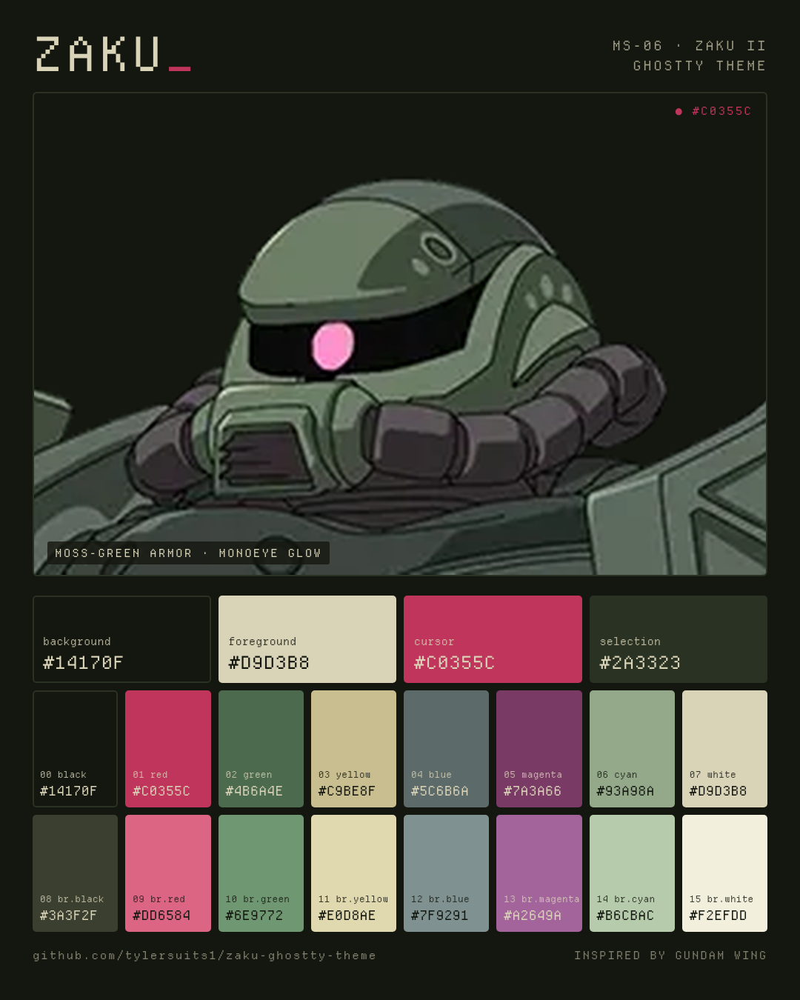

# Zaku — Ghostty theme

A [Ghostty](https://ghostty.org) color theme based on the MS-06 Zaku II —
olive/moss-green armor, cream trim, and that purple-red monoeye glow.
Inspired by Gundam Wing, a childhood favorite, and the rabbit hole of mobile
suits it led to (the Zaku itself hails from the original *Mobile Suit Gundam*).



## Palette

| Role | Hex | | Role | Hex |
|---|---|---|---|---|
| background | `#14170F` | | foreground | `#D9D3B8` |
| cursor | `#C0355C` | | selection | `#2A3323` |

| # | Normal | # | Bright |
|---|---|---|---|
| 0 black | `#14170F` | 8 | `#3A3F2F` |
| 1 red | `#C0355C` | 9 | `#DD6584` |
| 2 green | `#4B6A4E` | 10 | `#6E9772` |
| 3 yellow | `#C9BE8F` | 11 | `#E0D8AE` |
| 4 blue | `#5C6B6A` | 12 | `#7F9291` |
| 5 magenta | `#7A3A66` | 13 | `#A2649A` |
| 6 cyan | `#93A98A` | 14 | `#B6CBAC` |
| 7 white | `#D9D3B8` | 15 | `#F2EFDD` |

## Install

```sh
mkdir -p ~/.config/ghostty/themes
curl -fsSL https://raw.githubusercontent.com/tylersuits1/zaku-ghostty-theme/main/Zaku \
  -o ~/.config/ghostty/themes/Zaku
```

Then add to `~/.config/ghostty/config`:

```
theme = Zaku
```

Suggested font: [Departure Mono](https://departuremono.com).

## Also

- [Tallgeese](https://github.com/tylersuits1/tallgeese-ghostty-theme) — the pearl-white, crest-red companion theme.
- Pairs well with [Sheets](https://github.com/tylersuits1/Sheets) — manage this theme (and your fonts, opacity) across Ghostty, Kitty, and Alacritty from one place.

---

*Gundam* and the Zaku design are © Sotsu · Sunrise. This is an unofficial fan
project; reference imagery is included for palette attribution only.
